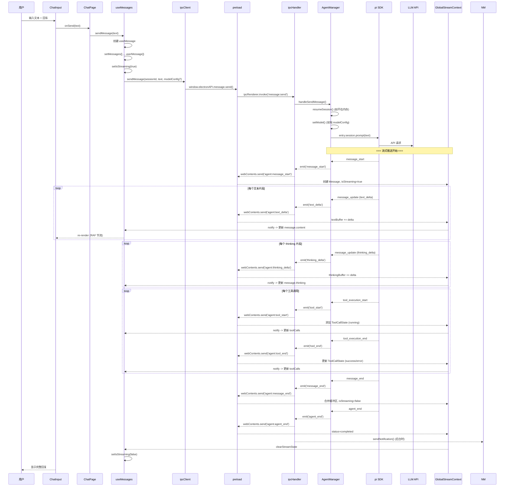

# Pair 项目架构分析

> 生成日期：2026-05-16

## 一、整体架构概览

Pair 是一个标准的 **Electron 三进程架构** 应用：

```
┌──────────────────────────────────────────────────────────┐
│ 渲染进程 (Renderer)         React 19 + TypeScript + Tailwind │
│ ┌──────────────────────────────────────────────────────┐ │
│ │  Context 层 (状态管理)                                 │ │
│ │  GlobalStreamContext / ModelContext / ThemeContext     │ │
│ │  MessageSettingsContext / SessionStateContext          │ │
│ ├──────────────────────────────────────────────────────┤ │
│ │  Hooks 层 (业务逻辑)                                   │ │
│ │  useSessions / useMessages / useModels / useTabState  │ │
│ ├──────────────────────────────────────────────────────┤ │
│ │  UI 组件层 (视图)                                      │ │
│ │  ChatPage / SessionList / ChatArea / TabBar / ...     │ │
│ └──────────────────────────────────────────────────────┘ │
├──────────────────────────────────────────────────────────┤
│ Preload 层              contextBridge 安全白名单            │
│  - 暴露 electronAPI 到 window                             │
│  - ipcRenderer.invoke/invoke (请求 - 响应)                │
│  - ipcRenderer.on (事件推送)                              │
│  - 14 个合法事件通道白名单校验                             │
├──────────────────────────────────────────────────────────┤
│ 主进程 (Main Process)    Node.js + Electron               │
│ ┌──────────────────────────────────────────────────────┐ │
│ │  IPC Handler    20+ 通道注册 + 事件转发                │ │
│ ├──────────────────────────────────────────────────────┤ │
│ │  Agent Manager  会话/模型/引擎管理 (EventEmitter)      │ │
│ ├──────────────────────────────────────────────────────┤ │
│ │  Notification   系统通知 (后台检测)                    │ │
│ ├──────────────────────────────────────────────────────┤ │
│ │  BrowserWindow  窗口创建/生命周期                       │ │
│ └──────────────────────────────────────────────────────┘ │
├──────────────────────────────────────────────────────────┤
│ AI SDK              @earendil-works/pi-coding-agent       │
│ AgentSession / SessionManager / ModelRegistry / AuthStorage │
└──────────────────────────────────────────────────────────┘
```

---

## 二、分层职责

### 2.1 主进程 (`src/main/`)

#### `index.ts` — 应用入口 + 窗口管理

```
职责: Electron 应用生命周期 + BrowserWindow 创建
- frame: false 无边框窗口 (自定义标题栏)
- contextIsolation: true (安全隔离)
- nodeIntegration: false
- 开发模式加载 localhost:5173，生产模式加载 dist 文件
```

#### `ipc-handler.ts` — IPC 通信枢纽

```
职责: 注册 20+ ipcMain.handle 通道 + 事件转发

请求-响应通道分类:
├── session:*       (create/list/delete/deleteAll/deleteAllInProject/info/update/messages)
├── message:*       (send/abort)
├── model:*         (list/current/set/testConnection/setApiKey/removeApiKey/syncConfig/removeConfig)
├── window:*        (minimize/maximize/close)
├── notification:*  (getConfig/updateConfig)
├── dialog:*        (selectFolder)
└── context:*       (usage)

事件转发 (main → renderer):
  监听 AgentManager 的 11 个事件类型，
  通过 webContents.send(`agent:${eventName}`, ...args) 推送到渲染进程

通知触发:
  agent_end 事件时检查是否应发送系统通知
```

#### `agent-manager.ts` — AI 引擎核心

```
职责: 会话生命周期、模型管理、事件派发

核心数据结构:
  sessions: Map<string, SessionEntry>     // 内存中的活跃会话
  sessionMetadata: Map<string, SessionInfo> // 持久化的元数据

关键方法:
  createSession()   -> SessionManager.create() -> createAgentSession()
  resumeSession()   -> SessionManager.open() -> createAgentSession()
  sendMessage()     -> session.prompt(text) (支持两种模型配置)
  abortSession()    -> session.abort()
  deleteSession()   -> try/finally 保证元数据清理

事件流 (SDK → AgentManager → IPCHandler):
  pi SDK 事件 -> setupSessionEventHandlers -> this.emit(eventName)
  SDK 事件类型:
    message_start / message_update / message_end
    tool_execution_start / tool_execution_update / tool_execution_end
    agent_start / agent_end / turn_start / turn_end

模型配置两种模式:
  1. 字符串 modelId -> findModel() -> ModelRegistry
  2. 对象 {provider, baseUrl, apiKey, modelId} -> createCustomModel() -> 直接构造 Model
```

#### `notification.ts` — 系统通知

```
职责: AI 完成回复时弹出 Windows 原生通知
条件:
  - 通知已启用
  - 窗口不在前台（isFocused === false）
点击通知: 恢复窗口并聚焦
```

#### `preload.ts` — 安全桥接

```
职责: contextBridge.exposeInMainWorld 暴露安全 API

暴露结构:
  window.electronAPI = {
    minimize/maximize/close,        // 窗口控制
    platform, versions,             // 环境信息
    session: { create/list/... },   // 会话管理
    message: { send/abort },        // 消息处理
    model: { list/set/... },        // 模型管理
    dialog: { selectFolder },       // 对话框
    context: { usage },             // 上下文使用
    notification: { getConfig/updateConfig },
    on(channel, callback),          // 事件订阅 (白名单14通道)
  }
```

---

### 2.2 渲染进程 (`src/renderer/`)

#### Context 层 — 全局状态管理

| Context | 数据存储 | 作用范围 | 持久化 |
|---------|----------|----------|--------|
| `ModelContext` | 自定义模型 CRUD | 全局 | localStorage |
| `ThemeContext` | 7 套主题 + 深浅模式 + 字体 | 全局 | localStorage + CSS 变量 |
| `MessageSettingsContext` | 折叠框/光标/时间戳 | 全局 | React state |
| `GlobalStreamContext` | 多会话并行流式状态 | 全局 | useRef (内存) |
| `SessionStateContext` | idle/streaming/completed/error | 全局 | useRef (内存) |

嵌套关系：
```
ThemeProvider
  └── ModelProvider
       └── MessageSettingsProvider
            └── SessionStateProvider
                 └── GlobalStreamProvider
                      └── App (ChatPage)
```

#### `GlobalStreamContext.tsx` — 核心流式状态管理

```
数据结构:
  SessionStreamState {
    streaming: {
      message: Message | null    // 当前流式消息
      textBuffer: string         // 文本缓冲区
      thinkingBuffer: string     // 思考过程缓冲区
      isStreaming: boolean
      lastUpdateTime: number
    }
    toolCalls: ToolCallState[]   // 工具调用状态列表
    status: UnifiedSessionStatus // idle/streaming/completed/error
  }

事件监听 (全局注册，不随会话切换而中断):
  agent:message_start  -> 创建新 Message，标记 isStreaming=true
  agent:text_delta     -> 追加到 textBuffer
  agent:thinking_delta -> 追加到 thinkingBuffer
  agent:message_end    -> 合并缓冲区到 Message，isStreaming=false
  agent:tool_start     -> 添加 ToolCallState (status=running)
  agent:tool_end       -> 更新 ToolCallState (success/error)
  agent:agent_end      -> status=completed
  agent:agent_start    -> status=streaming

订阅机制:
  subscribe(sessionId, callback) -> unsubscribe()
  下游组件可订阅指定会话的状态更新，精准通知
```

#### Hooks 层 — 业务逻辑

| Hook | 职责 | 关键实现 |
|------|------|---------|
| `useSessions` | 会话列表/创建/删除/切换 | `messagesCacheRef` 缓存、localStorage 恢复 |
| `useMessages` | 消息发送/流式接收/历史加载 | 3 个 useEffect 管理事件订阅、消息缓存同步 |
| `useModels` | 模型列表/当前模型/切换 | `model:list` IPC + `useModelContext` 自定义模型 |
| `useTabState` | 标签页 CRUD + 持久化 | 最多 10 个标签，localStorage 持久化 |

#### `useMessages.ts` — 消息处理细节

```
流式渲染机制:
  1. sendMessage() 添加用户消息，设置 isStreaming=true
  2. useEffect #1: 切换会话时加载历史消息 (从缓存或 IPC)
  3. useEffect #2: message_end 处理完成消息，agent_end 清理流式状态
  4. useEffect #3: 订阅 GlobalStreamContext，实时更新 toolCalls 和文本

消息缓存:
  messagesCacheRef (Map<string, Message[]>) 在 useSessions 中维护
  切换会话时优先读取缓存，减少 IPC 调用

模型传递:
  如果 currentModelId 匹配 modelConfigs 中的某个配置，
  传递完整配置对象 {provider, baseUrl, apiKey, modelId} 走 createCustomModel 路径
  否则不传 modelConfig，使用会话当前模型
```

---

### 2.3 共享类型 (`src/shared/types.ts`)

```
核心类型:
  SessionInfo    -> 会话元数据 (id/name/projectPath/model/...)
  ProjectSessions -> 按项目分组的会话列表
  Message        -> 消息 (id/role/content/thinking/toolCalls/usage)
  ToolCall       -> 工具调用 (id/name/args/status/result)
  ModelInfo      -> 模型信息 (id/name/provider/contextWindow)
  Usage          -> Token 使用情况
  NotificationConfig -> 通知配置
```

---

## 三、IPC 通信协议

### 3.1 请求-响应 (invoke/handle)

```
渲染进程                               主进程
─────────────────────────────────────────────
ipcClient.createSession()
  → preload.session.create()
    → ipcRenderer.invoke('session:create') ──→ ipcMain.handle('session:create')
                                                  → AgentManager.createSession()
                                              ←── 返回 SessionInfo
    ←── Promise<SessionInfo>
  ←── SessionInfo
←── 更新 state
```

### 3.2 事件推送 (send/on)

```
主进程                                   渲染进程
─────────────────────────────────────────────
AgentManager.emit('text_delta', data)
  → IPCHandler 监听
    → webContents.send('agent:text_delta') ──→ preload.on('agent:text_delta')
                                                 → GlobalStreamContext 回调
                                                   → textBuffer += delta
                                                     → notify subscribers
                                                       → useMessages 更新 state
                                                         → ChatArea re-render
```

### 3.3 事件通道白名单

preload.ts 中严格校验的 14 个合法通道：

```
agent:message_start
agent:text_delta
agent:thinking_delta
agent:message_end
agent:tool_start
agent:tool_update
agent:tool_end
agent:agent_start
agent:agent_end
agent:turn_start
agent:turn_end
message:update
tool:start
tool:end
```

---

## 四、完整数据流：用户发送消息 → AI 回复



---

## 五、持久化策略

| 数据 | 位置 | 格式 | 更新时机 |
|------|------|------|---------|
| 会话元数据 | `%APPDATA%/pair/session-metadata.json` | JSON | 创建/删除/更新/发送消息后 |
| 会话消息 | `.pair/sessions/<id>/*.json` | (pi SDK 管理) | 每次 AI 回复完成 |
| 模型配置 | `~/.pi/agent/models.json` | JSON | 添加/编辑/删除模型时 |
| 主题设置 | `localStorage` | 键值 | 切换主题/模式/字号时 |
| 自定义模型 | `localStorage` | JSON | 添加/编辑/删除模型时 |
| 标签状态 | `localStorage` | JSON | 打开/关闭标签时 |
| 上次会话 | `localStorage` | sessionId | 切换会话时 |

---

## 六、构建流程

```
tsc -p tsconfig.electron.json     → dist/main/        (主进程 + preload)
vite build                        → dist/renderer/    (渲染进程)
echo {"type":"module"} > dist/main/package.json        (ESM 兼容)
electron-builder                  → release/           (安装包)
```

---

## 七、设计模式与关键设计决策

| 模式/决策 | 说明 |
|-----------|------|
| **EventEmitter 事件流** | AgentManager 继承 EventEmitter，SDK 事件 → AgentManager → IPC → 渲染进程，各层解耦 |
| **Ref 状态管理** | GlobalStreamContext 使用 useRef 而非 useState，避免全局 re-render |
| **订阅者模式** | 组件通过 subscribe(sessionId) 精准订阅，只有相关会话的组件更新 |
| **RAF 节流渲染** | useMessages 通过 requestAnimationFrame 节流流式文本的 DOM 更新 |
| **try/finally 元数据清理** | deleteSession 确保元数据始终被清理，即使 session.dispose() 失败 |
| **先清元数据再 dispose** | deleteAllSessions 先清空元数据文件，再逐个 dispose，防止异常导致脏数据残留 |
| **消息缓存** | useSessions 维护 messagesCacheRef，切换会话时避免重复 IPC 调用 |
| **两种模型配置** | 字符串 modelId 走 ModelRegistry，对象配置走 createCustomModel，支持任意 OpenAI 兼容 API |
